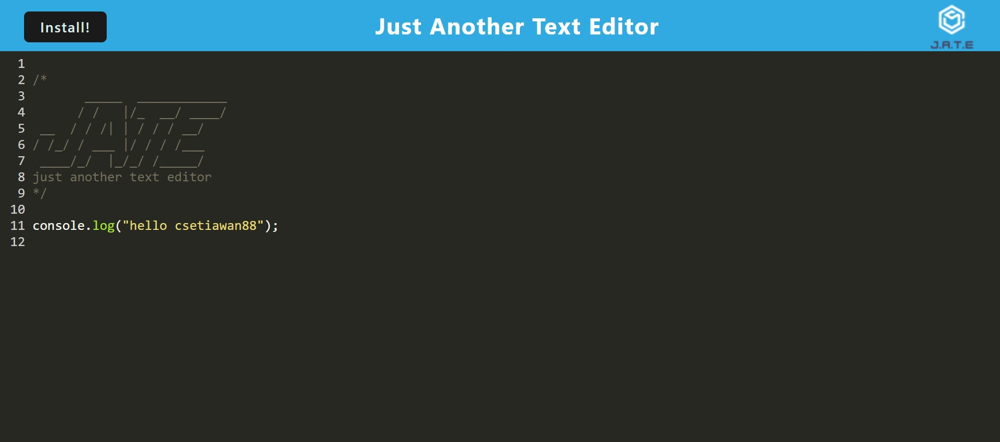
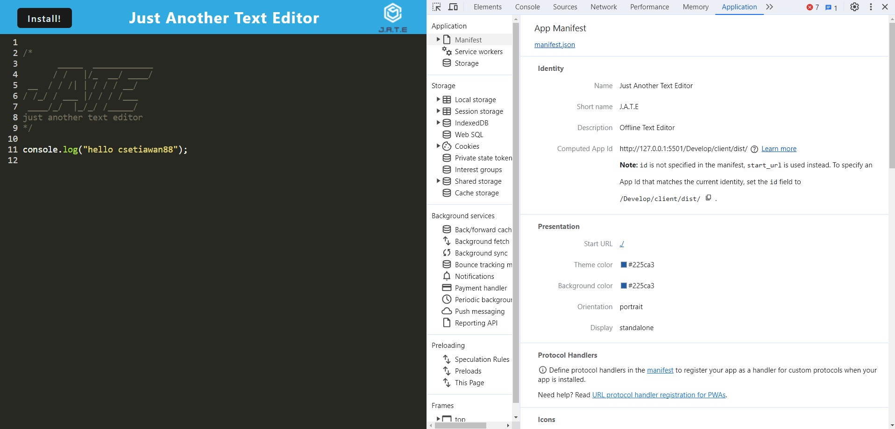
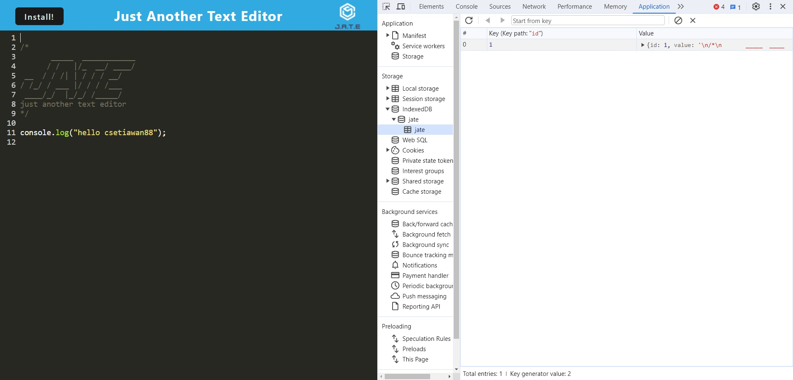
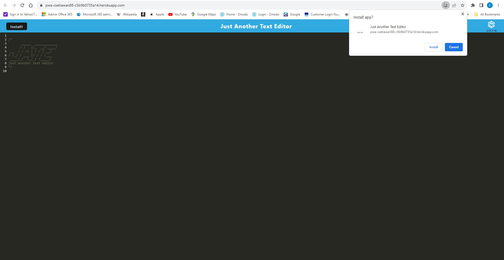
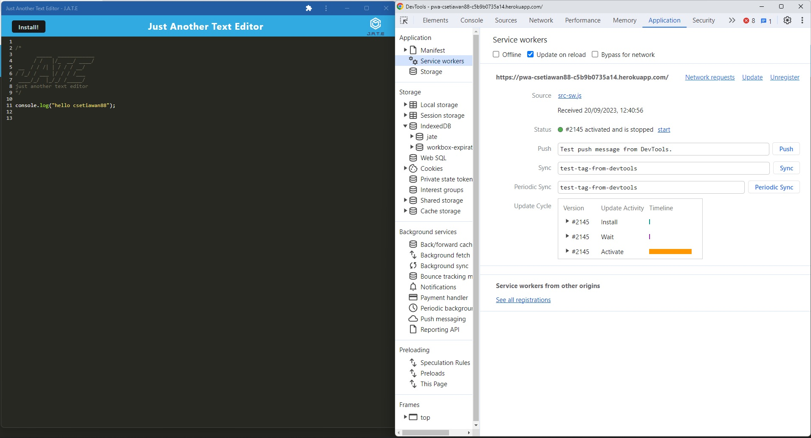

# Module 19 Challenge

# Progressive Web Applications (PWA) Challenge: Text Editor

## Description

As you have progressed through this course, you have put together a number of impressive projects that you can show off to potential employers. This project is no exception; in fact, it features some of the most impressive expressions of the concepts you have learned so far.

Your task is to build a text editor that runs in the browser. The app will be a single-page application that meets the PWA criteria. Additionally, it will feature a number of data persistence techniques that serve as redundancy in case one of the options is not supported by the browser. The application will also function offline.

To build this text editor, you will start with an existing application and implement methods for getting and storing data to an IndexedDB database. You will use a package called idb, which is a lightweight wrapper around the IndexedDB API. It features a number of methods that are useful for storing and retrieving data, and is used by companies like Google and Mozilla.

## User Story

```md
AS A developer
I WANT to create notes or code snippets with or without an internet connection
SO THAT I can reliably retrieve them for later use
```

## Acceptance Criteria

```md
GIVEN a text editor web application
WHEN I open my application in my editor
THEN I should see a client server folder structure
WHEN I run `npm run start` from the root directory
THEN I find that my application should start up the backend and serve the client
WHEN I run the text editor application from my terminal
THEN I find that my JavaScript files have been bundled using webpack
WHEN I run my webpack plugins
THEN I find that I have a generated HTML file, service worker, and a manifest file
WHEN I use next-gen JavaScript in my application
THEN I find that the text editor still functions in the browser without errors
WHEN I open the text editor
THEN I find that IndexedDB has immediately created a database storage
WHEN I enter content and subsequently click off of the DOM window
THEN I find that the content in the text editor has been saved with IndexedDB
WHEN I reopen the text editor after closing it
THEN I find that the content in the text editor has been retrieved from our IndexedDB
WHEN I click on the Install button
THEN I download my web application as an icon on my desktop
WHEN I load my web application
THEN I should have a registered service worker using workbox
WHEN I register a service worker
THEN I should have my static assets pre cached upon loading along with subsequent pages and static assets
WHEN I deploy to Heroku
THEN I should have proper build scripts for a webpack application
```

## Install & Run the Application

- npm install (install all packages required)
- npm run build
- Open index.html in live server (Run Locally)
- Else click on Heroku Link: https://pwa-csetiawan88-c5b9b0735a14.herokuapp.com/

## Repository - Link

GITHUB: https://github.com/csetiawan88/pwatexteditor

## Website Link

URL: https://pwa-csetiawan88-c5b9b0735a14.herokuapp.com/

## Contributing

csetiawan88 - https://github.com/csetiawan88/

## Screenshot

#### PWA Text Editor



#### Application's manifest.json file



#### Application's IndexedDB storage



#### Application's Install



#### Application's registered service worker



## Technologies


## Questions

If you have any additional questions, you can reach me at:
csetiawan@yahoo.com
